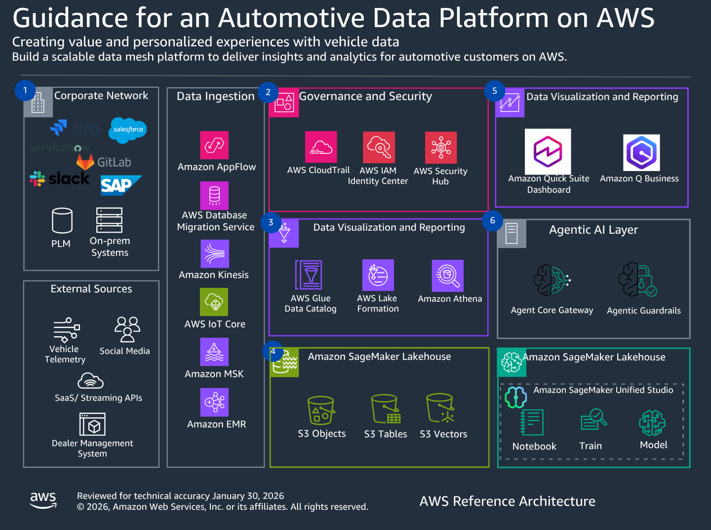

# Automotive Data Platform on AWS

The foundational analytical data platform for EV startups. ADP gives a
modern EV company the governed lake, synthetic data, and DataZone catalog
they need to ground analytics, ML, and agentic workloads — on day one.

> **v0.2 re-framing (2026-05).** ADP is no longer a collection of five
> independently-deployable guidances. It is one foundation deploy under
> [`platform-foundation/`](platform-foundation/) that publishes 9 governed
> data products. The legacy guidance subdirs are demoted to
> source-of-logic for the foundation generators. See
> [Migration from v0.1.0](#migration-from-v010) below.

---

## Table of contents

- [Why ADP](#why-adp)
- [What you get](#what-you-get)
- [The 9 data products](#the-9-data-products)
- [Quick start](#quick-start)
- [Repository layout](#repository-layout)
- [Architecture](#architecture)
- [Relationship to CMS and CVX](#relationship-to-cms-and-cvx)
- [Migration from v0.1.0](#migration-from-v010)
- [Documentation](#documentation)
- [Cost estimates](#cost-estimates)
- [Contributing](#contributing)
- [License](#license)

---

## Why ADP

Modern EV startups build on AWS from day one. They need a data
foundation that matches how they
actually operate: vehicle telemetry, charging behavior, OTA campaigns,
customer interactions, and service records — all governed and joinable
for analytics, ML, and agent grounding.

ADP is that foundation. It is the analytical layer in a three-layer
EV-startup portfolio:

| Layer | Repo | What it does |
|---|---|---|
| Operational | [CMS](https://github.com/aws-solutions-library-samples/guidance-for-connected-mobility-on-aws) | How the EV startup runs the vehicle — real-time ingest, fleet ops UI, FleetWise telemetry |
| **Analytical** | **ADP (this repo)** | **How the EV startup analyzes its data — governed lake, data products, agent grounding** |
| Channel | CVX | How the EV startup talks to customers — voice, agentic, multi-channel |

Each layer is independently deployable. Each delivers full value alone.
Together is additive. Neither CMS nor CVX takes a code or runtime
dependency on ADP.

## What you get

A single deploy under [`platform-foundation/`](platform-foundation/)
provisions:

- **Amazon DataZone V2 domain** (`adp-{stage}-foundation-domain`) with
  9 producer projects + 1 smoke-test consumer project, all auto-grant
  within the domain.
- **S3 + Glue + Iceberg lake** with one Glue database per data product
  (`adp_{stage}_<product>`) and a shared `adp_{stage}_dimensions`
  database.
- **Realistic synthetic data** with referential integrity preserved by
  construction across products, intentional 1–3% edge-case injection
  per the six-code taxonomy, VSS-aligned vehicle signals, and
  EV-startup-shaped distributions (battery age × SoH correlation,
  winter range loss, post-OTA efficiency drift, ~70/25/5 charging mix).
- **Cross-cutting governance**: Lake Formation tag-based access
  control, AWS Macie classification on PII-bearing prefixes, CloudTrail
  data-event logging on the lake bucket, IAM Identity Center groups
  (`adp-{stage}-data-owners`, `-data-consumers`, `-platform-admins`).
- **Bedrock Knowledge Base seeding** for the `vehicle_knowledge_base`
  product (DTCs, TSBs, recalls, owner manuals, parts catalog, service
  network, charging narratives, OTA rollout summaries).
- **Reference consumer**: a SageMaker Studio predictive-maintenance
  notebook that subscribes to four products via DataZone, joins them
  in Athena, and trains an Isolation-Forest at-risk-VIN model.
- **End-to-end verification**: `scripts/smoke-test-subscription.sh`,
  `scripts/verify-standalone.sh`, `scripts/verify-contract-queries.sh`,
  `scripts/profile-data.py`, and a CloudWatch data-quality dashboard.

See [`docs/DEPLOYMENT.md`](docs/DEPLOYMENT.md) for the per-stage
runbook and [`docs/data-contracts.md`](docs/data-contracts.md) for the
schema, identifier-format, and partition conventions.

## The 9 data products

All 9 products publish to the same DataZone domain. Eight are
Iceberg-backed; one (`vehicle_knowledge_base`) is a Bedrock Knowledge
Base built from text artifacts on S3.

| # | Domain | Display name | Technical name | Partition |
|---|---|---|---|---|
| 1 | Automotive | **Vehicle Telemetry (Aggregated)** | `vehicle_telemetry_aggregated` | `event_date`, bucketed by `vin` (16) |
| 2 | Automotive | **Vehicle Identity Graph** | `vehicle_identity` | `model_year` |
| 3 | EV Operations | **Charging Sessions** | `charging_sessions` | `session_date`, bucketed by `vin` (16) |
| 4 | EV Operations | **Energy Usage** | `energy_usage` | `usage_date` |
| 5 | EV Operations | **OTA Campaigns** | `ota_campaigns` | `campaign_id` (header) + `dispatch_date` (events) |
| 6 | Customer | **Customer 360** | `customer_360` | `snapshot_date` |
| 7 | Customer | **Customer Interactions** | `customer_interactions` | `interaction_date`, bucketed by `customer_id` (16) |
| 8 | Service | **Service Records** | `service_records` | `service_month` |
| 9 | Knowledge | **Vehicle Knowledge Base** | `vehicle_knowledge_base` | (text artifacts; not Iceberg — direct S3 + Bedrock KB) |

Per-product schemas, sample queries, and lineage live under
[`platform-foundation/source/data-products/<product>/`](platform-foundation/source/data-products/).
Cross-product join examples live under
[`platform-foundation/source/athena-queries/`](platform-foundation/source/athena-queries/).

## Quick start

The foundation deploys to a single AWS account in `us-east-1`. Two
stages are supported: `staging` and `prod`. Macie session enablement
is account-singular and runs once via a separate `bootstrap` target.

```bash
# 1. Install dependencies (Python 3.12+, Node 20+, AWS CLI v2, CDK 2.255+)
cd platform-foundation
make install

# 2. One-time, account-level
make bootstrap

# 3. Per-stage deploy
make deploy STAGE=staging

# 4. Generate dimensions and per-product synthetic data
make seed STAGE=staging

# 5. Smoke-test DataZone subscription end-to-end
make smoke-test STAGE=staging
```

`STAGE` is required and fail-closed; `make deploy` (no `STAGE`) exits
non-zero. See [`docs/DEPLOYMENT.md`](docs/DEPLOYMENT.md) for the full
runbook including prereqs, post-deploy validation, the optional
CMS-ingest enablement procedure, and tear-down.

**Staging foundation status (2026-06-22)**: Data-shipped for **all 9 products** (6 pandas + 2 PySpark via Glue 5.1 + 1 KB) + 7 dimensions + Knowledge Base artifacts (lake non-empty, 8 Iceberg + Hive EXTERNAL TABLEs, ~144.8M queryable rows including 20M from the 2 newly-shipped PySpark products, 9/20 contract queries live-PASS with 11 expected-fails documented in spec-local `expected-failing-queries.txt`; VKB corpus: 57 docs / 23 DTC guides, `source_category` metadata sidecars per spec `2026-06-22-adp-vkb-content-fill`). The 2 PySpark products (`vehicle_telemetry_aggregated`, `energy_usage`) were shipped 2026-06-11 via spec `2026-06-09-adp-pyspark-glue-products` at sample tier (10M rows / 90 days each) on AWS Glue 5.1 + Iceberg 1.10.0; production-scale follow-up tracked as P3. Production stage pending user decision per memo §6.

## Repository layout

```
automotive-data-platform-on-aws/
├── platform-foundation/          # ← canonical foundation deploy
│   ├── app.py                    # CDK app (5 stage stacks + bootstrap)
│   ├── stacks/                   # network, lake, datazone, datazone-projects, governance
│   ├── source/
│   │   ├── data-products/        # 9 product generators + per-product schemas
│   │   ├── dimensions/           # 7 dimension-catalog generators
│   │   ├── athena-queries/       # cross-product join examples
│   │   ├── reference-consumers/  # predictive-maintenance notebook
│   │   ├── quality-dashboard/    # CloudWatch data-quality dashboard
│   │   └── optional/cms_ingest/  # opt-in CMS DDB → ADP Iceberg ingest
│   ├── scripts/                  # deploy, smoke-test, verify, teardown, profile
│   └── tests/                    # 150+ schema, FK, edge-case, distribution tests
│
├── docs/
│   ├── DEPLOYMENT.md             # per-stage runbook
│   ├── data-contracts.md         # VSS subset, identifier formats, partitions
│   ├── cvx-integration-contract.md  # contract for CVX consumers
│   ├── cms-ingest-optional-module.md  # opt-in CMS ingest doc
│   └── tech.md                   # SDK/framework verification notes
│
├── guidance-for-*/               # demoted — source-of-logic only (see Migration)
└── datasource/                   # demoted — superseded by platform-foundation/
```

## Architecture



The platform-foundation CDK app deploys five per-stage stacks plus one
account-singular bootstrap stack:

```
┌──────────────────────────────────────────────────────────────────┐
│  adp-shared-bootstrap          (account-level, deploy once)      │
│  └── Macie session                                               │
└──────────────────────────────────────────────────────────────────┘
                               │
┌──────────────────────────────┼───────────────────────────────────┐
│  Per stage (staging | prod) — adp-{stage}-foundation-*           │
│                              │                                   │
│  network ── lake ── datazone ── datazone-projects ── governance  │
│            │            │                                        │
│            ├── 1 lake bucket (Iceberg, KMS, versioned, replicated)
│            ├── 10 Glue databases (9 products + 1 dimensions)     │
│            ├── DataZone domain (10 projects, auto-grant)         │
│            ├── Lake Formation tag-based access control           │
│            ├── CloudTrail data events                            │
│            ├── IAM Identity Center groups                        │
│            └── (optional) cms-ingest stack — opt-in via context  │
└──────────────────────────────────────────────────────────────────┘
```

The 9 data products are populated by independent generators that
consume a shared dimension catalog (5M VINs, 5M customers, 200
dealers, 500 suppliers, 50K parts, 50K charging stations, 10y of
calendar). Generators are deterministic under a fixed seed — re-runs
produce byte-identical parquet.

Consumers (CVX agents, SageMaker Studio notebooks, BI dashboards)
subscribe to data products via DataZone. See
[`docs/cvx-integration-contract.md`](docs/cvx-integration-contract.md)
for the canonical consumer pattern (auth, IAM, sample Athena queries
per product, cross-product joins, Bedrock KB seeding, lineage trace).

## Relationship to CMS and CVX

ADP, CMS, and CVX are **independent accelerators** that converge on
shared schema conventions. There is no code or runtime dependency
between them in either direction, with one explicitly opt-in
exception (CMS → ADP ingest, off by default).

### CMS

[CMS (Connected Mobility on AWS)](https://github.com/aws-solutions-library-samples/guidance-for-connected-mobility-on-aws)
owns the operational layer — DynamoDB, Redis, MSK, Flink, fleet UI,
FleetWise telemetry. CMS continues to deploy standalone to a clean
account with zero ADP references.

The convergence is **schema-only**:

- ADP publishes [`docs/data-contracts.md`](docs/data-contracts.md)
  declaring the VSS signal subset, identifier formats (VIN,
  `customer_id`, `dealer_id`, `supplier_id`, `part_number`,
  `station_id`), time/date conventions, and Iceberg partition
  conventions.
- CMS optionally references this doc from its own `docs/`.
- Drift is caught by an ADP-side test suite that asserts synthetic-
  data conformance to the documented contracts.

There is no shared code package, no import in either direction, and
no deploy ordering. The `scripts/verify-cms-standalone.sh` harness in
this repo confirms CMS synthesizes cleanly with zero ADP artifact
references.

### Optional CMS → ADP ingest

When CMS and ADP are deployed in the same account, an opt-in CDK
context flag enables a DynamoDB Streams → Kinesis Firehose → S3 raw →
Glue Iceberg MERGE pipeline that lands CMS DynamoDB updates in an
`adp_{stage}_cms_ingest` Glue database. Off by default. Disabled
deploys synthesize zero ingest resources. See
[`docs/cms-ingest-optional-module.md`](docs/cms-ingest-optional-module.md)
for the rationale, prereqs, enable command, cost estimate, and
disable command.

### CVX

CVX is the channel layer (voice, agentic, multi-channel customer
conversations). CVX agents subscribe to ADP data products via
DataZone to ground multi-channel conversations on a single coherent
customer view. The contract is documented in
[`docs/cvx-integration-contract.md`](docs/cvx-integration-contract.md):
17 sample SQL blocks across 9 per-product queries plus 4
cross-product joins (customer × charging × energy, VIN × OTA × energy,
customer × service × charging, full-VIN-360), plus the Bedrock KB
seeding and lineage-trace patterns. CVX takes no code or runtime
dependency on ADP — only a documented subscription flow.

## Migration from v0.1.0

v0.1.0 of this repo shipped five independently-deployable guidances
plus a `datasource/` synthetic data generator. v0.2 collapses that
shape into one foundation deploy.

### What changed

| v0.1.0 location | v0.2 disposition |
|---|---|
| `guidance-for-agentic-customer-360/` | **Demoted** — generation logic ported into `platform-foundation/source/data-products/{customer_360,customer_interactions,service_records}/`. QuickSight + Aurora pgvector + Bedrock-Agent CDK dropped (not foundation v1). |
| `guidance-for-vehicle-knowledge-base/` | **Deleted** (2026-06-17 per spec `2026-06-16-adp-vehicle-knowledge-base`) — generators ported into `platform-foundation/source/data-products/vehicle_knowledge_base/`; the Bedrock KB construct now lives at `platform-foundation/stacks/vehicle_knowledge_base_stack.py`. See `docs/DEPLOYMENT.md` § "Vehicle Knowledge Base". Deprecation paper-trail in `MIGRATION-FROM-V0.1.0.md`. |
| `guidance-for-telemetry-normalization/` | **Demoted implementation, retained use case** — the v0.1.0 Flink pipeline is not re-implemented by the v0.2 foundation deploy, but telemetry normalization remains a documented ADP architecture pattern (see `telemetry-normalization.adoc` in the Implementation Guide). CMS is cited as a reference implementation; it is not the sole or required home for this pattern. |
| `guidance-for-data-governance/` | **Demoted** — replaced by the foundation's cross-cutting Lake Formation tag-based access control + Macie + CloudTrail layer. EU Data Act / GDPR cross-region split is out of foundation v1 scope. |
| `guidance-for-predictive-maintenance/` | **First-class consumer** — a tire-focused predictive-maintenance ML pipeline that consumes platform-foundation governed data products (tire telemetry, service records, vehicle identity) via DataZone, Lake Formation, and Athena. Generates tire-health predictions using both supervised and unsupervised approaches. See `predictive-maintenance.adoc` in the Implementation Guide for architecture and the code directory for the `TirePredictiveMaintenanceStack` CDK implementation. |
| `datasource/cx-analytics/`, `datasource/crm/` | **Demoted** — superseded by the unified per-product generators under `platform-foundation/source/data-products/`. |

### What was added

- 3 net-new EV-Operations data products: `charging_sessions`,
  `energy_usage`, `ota_campaigns`.
- 1 net-new dimension: `charging_stations` (50K stations across Tesla
  SC, Electrify America, EVgo, ChargePoint, home/destination).
- A unified `make seed STAGE=...` pipeline that emits dimensions
  first, then 9 products, then runs referential-integrity tests.
- DataZone V2 domain + projects + auto-grant subscription.
- Two-stage rollout (`staging`, `prod`) with stack-name prefixes and
  fail-closed Makefile gates.

### What was dropped

- QuickSight dashboards (Customer 360 v0.1.0 had 8 datasets).
- Aurora pgvector knowledge base (replaced by Bedrock KB +
  OpenSearch Serverless on the `vehicle_knowledge_base` product).
- Custom Bedrock-Agent CDK (foundation v1 publishes the data; agents
  live in CVX).
- Tire-anomaly Random Cut Forest API (replaced by the SageMaker
  notebook with Isolation-Forest as a reference example).
- Multi-region EU/global split, EU Data Act portal (out of scope for
  foundation v1).
- Manufacturing data products (`production_quality`,
  `supplier_traceability`) — not EV-startup foundational; deferred to
  a possible v2.

### What v0.1.0 users need to do

1. Tear down v0.1.0 deploys (each guidance subdir was a standalone
   stack family). Synthetic data was scoped to each guidance — no
   cross-guidance migration is required.
2. Pull `main` and follow [Quick start](#quick-start) above to deploy
   the foundation under `platform-foundation/`.
3. Re-create downstream consumers against the new DataZone catalog.
   The 9 products preserve column-level intent for everything that
   was in v0.1.0 (Customer 360 attributes, vehicle identity graph,
   knowledge artifacts) plus the three EV-Operations additions.

The original README content for each demoted guidance subdir
(architecture diagrams, design rationale, deployment notes) remains
in place under `guidance-for-*/README.md` for historical reference.
Each subdir's top section now carries a `DEPRECATED — see
platform-foundation/` notice.

## Documentation

| Doc | What it covers |
|---|---|
| [`docs/DEPLOYMENT.md`](docs/DEPLOYMENT.md) | Per-stage deploy runbook, prereqs, smoke tests, tear-down, troubleshooting, optional CMS-ingest enablement |
| [`docs/data-contracts.md`](docs/data-contracts.md) | VSS signal subset, identifier formats with regex, time/date conventions, Iceberg partition conventions, explicit non-dependencies |
| [`docs/cvx-integration-contract.md`](docs/cvx-integration-contract.md) | Subscription flow, IAM contract, per-product Athena queries, cross-product joins, Bedrock KB seeding, lineage trace |
| [`docs/cms-ingest-optional-module.md`](docs/cms-ingest-optional-module.md) | Opt-in rationale, enable / disable commands, cost estimate, single-account vs cross-account guidance |
| [`docs/tech.md`](docs/tech.md) | SDK/framework verification — DataZone V2, Glue Iceberg, Athena Engine V3, Lake Formation, Bedrock KB, PyIceberg, Kinesis Firehose, VSS spec |
| [`platform-foundation/README.md`](platform-foundation/README.md) | Foundation-level developer guide |
| Per-product READMEs | `platform-foundation/source/data-products/<product>/README.md` — schema, partitions, sample queries, lineage |

## Cost estimates

The foundation lake itself is the dominant cost. Synthetic-data scale
is intentionally large enough to exercise real query patterns.

| Component | Approx monthly cost (us-east-1) |
|---|---|
| S3 lake bucket (synthetic data, ~2–3 TiB at full Spark scale) | $50–80 |
| Glue catalog (10 databases) | <$5 |
| Athena queries (development workload) | $5–25 |
| DataZone V2 domain | $0 (consumption-based; minimal at v1) |
| Macie classification | $30–80 (PII-bearing prefixes only) |
| CloudTrail data events | $5–15 |
| Bedrock Knowledge Base + OpenSearch Serverless | $200–400 |
| CloudWatch quality dashboard | $3 (flat, first 3 dashboards/account/region free) |
| Optional CMS-ingest module (one CMS table) | +$256 (Firehose + Glue MERGE) |
| **Foundation only** | **~$300–600** |
| **+ Optional CMS-ingest** | **~$550–860** |

Costs scale with synthetic-data refresh frequency, query volume, and
KB ingestion cadence. See AWS pricing pages for current rates; this
repo does not provide ongoing cost forecasts.

## Contributing

See [CONTRIBUTING.md](CONTRIBUTING.md) for guidelines.

## License

This project is licensed under the MIT-0 License. See [LICENSE](LICENSE).

---

## Notices

*Customers are responsible for making their own independent assessment
of the information in this Guidance. This Guidance: (a) is for
informational purposes only, (b) represents AWS current product
offerings and practices, which are subject to change without notice,
and (c) does not create any commitments or assurances from AWS and
its affiliates, suppliers or licensors. AWS products or services are
provided "as is" without warranties, representations, or conditions
of any kind, whether express or implied. AWS responsibilities and
liabilities to its customers are controlled by AWS agreements, and
this Guidance is not part of, nor does it modify, any agreement
between AWS and its customers.*
