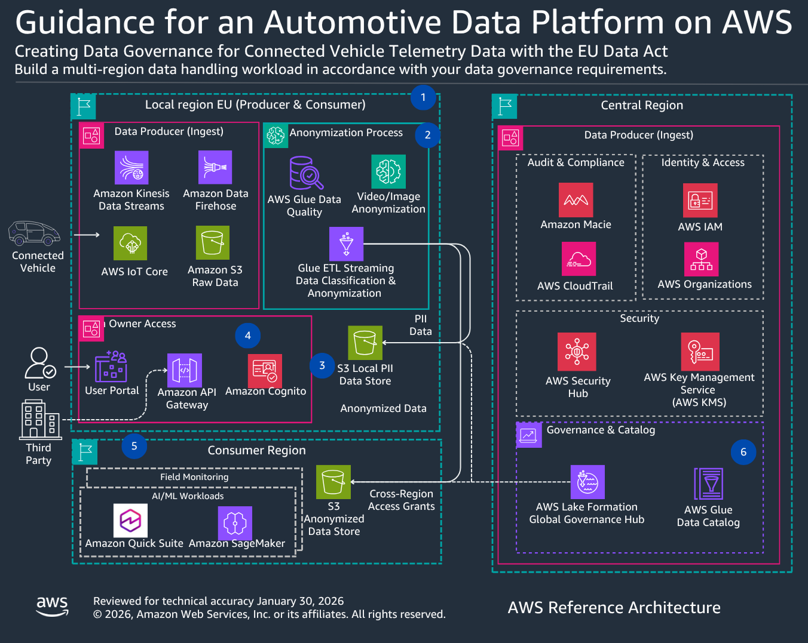

# Automotive Data Governance

Multi-region data governance framework supporting EU Data Act and GDPR compliance for connected vehicle data.



## Overview

Automotive manufacturers face a unique challenge: vehicle telemetry contains PII (GPS coordinates, driver behavior, VINs) that must remain in specific regions for compliance, yet R&D teams worldwide need access to anonymized data for product development. This guidance shows how to separate PII processing in EU regions from anonymized analytics in global regions using AWS Lake Formation, AWS Glue, and Amazon Macie.

## Key Capabilities

- **Multi-region data architecture** — Separate data domains for EU producers (PII + anonymized), global consumers (anonymized only), and central governance
- **EU Data Act support** — Data sharing mechanisms enabling vehicle owners and authorized third parties to access vehicle-generated data
- **Data sovereignty** — Region-specific residency controls ensuring PII remains in EU regions via Lake Formation policies
- **Cross-region data sharing** — Governed data exchange using Lake Formation resource links that enforce producer-region permissions
- **GDPR support** — Technical controls for data subject rights (access, erasure, portability)
- **Automated PII detection** — Amazon Macie scans with custom patterns for VINs, license plates, and driver identifiers
- **Anonymization pipeline** — Glue ETL for GPS geofencing, VIN hashing (SHA-256), and driver behavior aggregation
- **Audit and lineage** — Complete tracking via CloudTrail and Glue Data Catalog

## Architecture

```
┌─────────────────────────────────────────────────────────────────┐
│  Central Governance Account                                     │
│  AWS Lake Formation │ AWS Glue Data Catalog │ AWS CloudTrail    │
│  AWS Organizations  │ IAM                   │ Amazon Macie      │
└──────────────────────────┬──────────────────────────────────────┘
                           │
              ┌────────────┴────────────┐
              ▼                         ▼
┌──────────────────────┐  ┌──────────────────────────┐
│  EU Producer Region  │  │  Global Consumer Region  │
│  (eu-west-1)         │  │  (us-east-1)             │
│                      │  │                          │
│  S3: PII Data Store  │  │  Lake Formation          │
│  - GPS coordinates   │  │  Resource Links          │
│  - Driver info       │  │  (anonymized only)       │
│  - Vehicle IDs       │  │                          │
│                      │  │  Amazon Athena            │
│  S3: Anonymized      │──│→ Amazon SageMaker        │
│  - Hashed IDs        │  │  Amazon QuickSight       │
│  - City-level GPS    │  │                          │
│  - Aggregated metrics│  │  R&D teams access        │
│                      │  │  anonymized data only    │
│  Glue ETL Streaming  │  │                          │
│  (classification +   │  └──────────────────────────┘
│   anonymization)     │
│                      │  ┌──────────────────────────┐
│  Amazon Cognito      │  │  Vehicle Owner Portal    │
│  User Portal         │──│→ API Gateway             │
│  (data subject       │  │  (EU Data Act access)    │
│   access rights)     │  └──────────────────────────┘
└──────────────────────┘
```

## Solution Components

| Component | AWS Service | Purpose |
|-----------|------------|---------|
| PII Detection | Amazon Macie | Automated scanning with custom patterns for VINs, license plates, driver IDs |
| Anonymization | AWS Glue ETL | GPS geofencing, VIN hashing, driver behavior aggregation |
| Data Classification | AWS Glue ETL Streaming | Real-time separation of PII vs anonymized data |
| Access Control | AWS Lake Formation | Fine-grained permissions, resource links for cross-region sharing |
| Data Catalog | AWS Glue Data Catalog | Centralized metadata for all data assets |
| Audit | AWS CloudTrail | Complete data access logging for compliance reporting |
| Owner Portal | Amazon Cognito + API Gateway | Vehicle owner and third-party data access (EU Data Act) |
| Multi-Account | AWS Organizations + IAM | Account isolation between producer, consumer, and governance |

## Directory Structure

```
guidance-for-data-governance/
├── README.md
├── docs/
│   └── governance.png              # Architecture diagram
├── source/
│   ├── glue-jobs/                  # Anonymization and classification ETL
│   ├── macie-config/               # Custom PII detection patterns
│   └── lake-formation/             # Cross-region policies and resource links
└── stacks/                         # CDK stacks (future)
```

## Prerequisites

- AWS Organizations with multi-account structure (governance, EU producer, global consumer)
- AWS Lake Formation configured in each account
- S3 buckets for PII and anonymized data stores in the EU producer region

## Getting Started

This guidance is currently a reference architecture with documentation. Implementation artifacts (Glue jobs, Lake Formation policies, Macie configurations) will be added in future iterations.

See the [Implementation Guide](https://docs.aws.amazon.com/guidance/latest/automative-data-platform-on-aws/automotive-data-governance.html) for detailed architecture documentation.

## Related Guidance

- [CMS Integration Guide](docs/CMS_INTEGRATION.md) — How to connect the Connected Mobility telemetry pipeline to this governance framework
- [Telemetry Normalization](../guidance-for-telemetry-normalization/) — Normalized telemetry feeds into the governance framework for PII classification
- [Predictive Maintenance](../guidance-for-predictive-maintenance/) — Consumes anonymized data from the governance framework for ML model training
- [Agentic Customer 360](../guidance-for-agentic-customer-360/) — Customer analytics using governed, anonymized data
