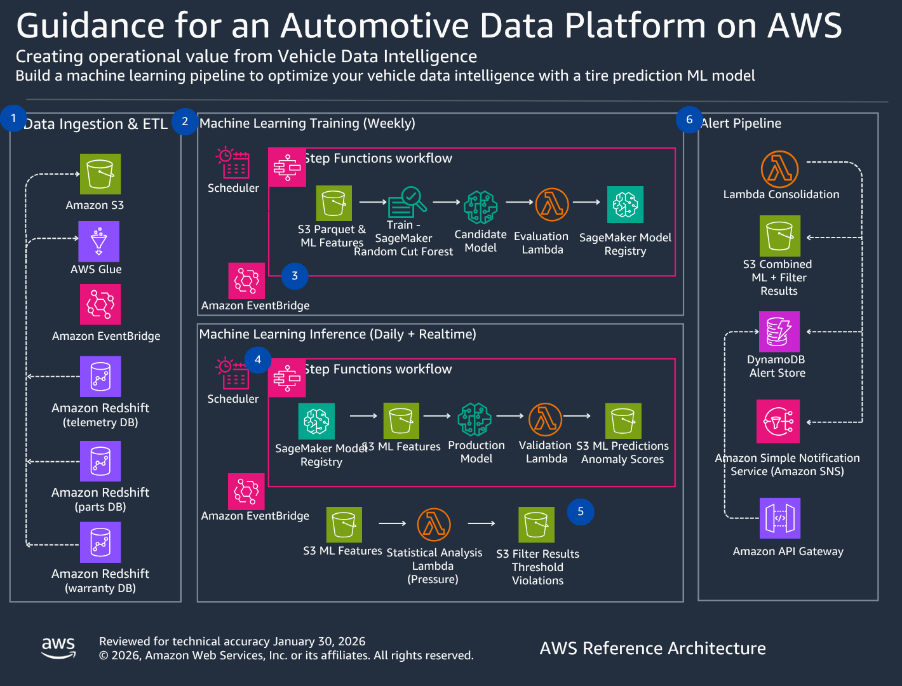
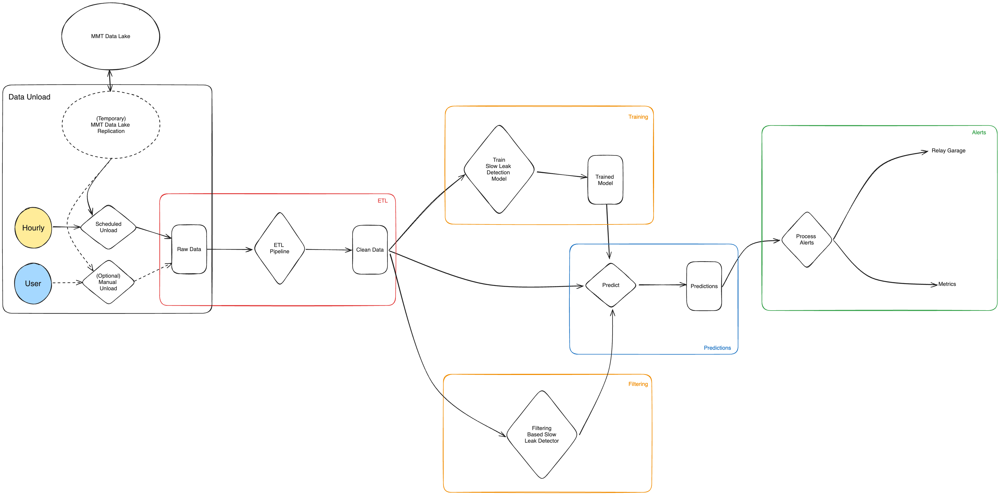
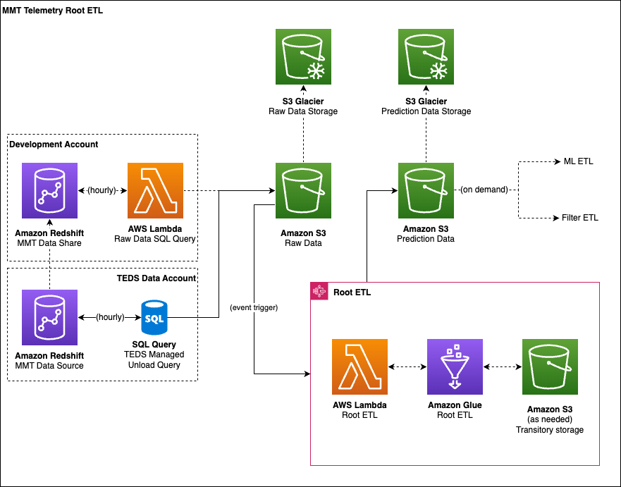
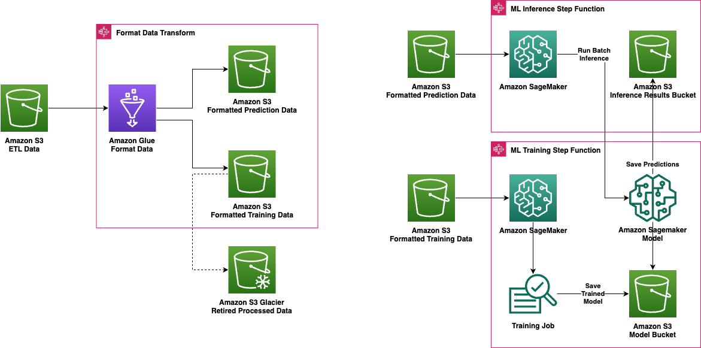
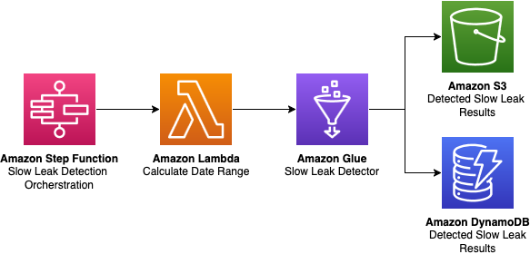
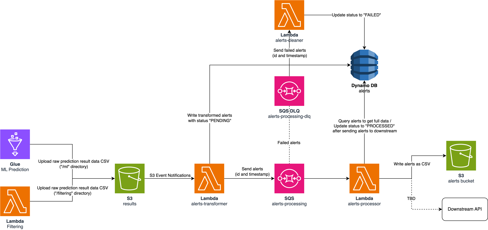

# Amazon Fleet Tire Predictive Maintenance



## Background

This guidance was developed in collaboration with Amazon's Middle Mile Transportation team, who operate one of the world's largest commercial vehicle fleets. The predictive maintenance algorithms and data pipelines in this solution were built using real-world fleet telemetry data from Amazon's delivery network — tire pressure readings, temperature data, and vehicle operating conditions collected across thousands of vehicles over multiple years.

While the specific algorithms and thresholds in this guidance may differ from what Amazon uses internally in production, the architecture patterns, data processing pipelines, and ML approach are directly informed by that operational experience. Customers can use this guidance the same way we built it for our fleet operations team: deploy the infrastructure, connect your telemetry data source, train the models on your fleet's data, and tune the alert thresholds to match your maintenance workflows.

The Redshift data source integration reflects the internal architecture used by Amazon's fleet team. For customers using the [Connected Mobility Guidance](https://github.com/aws-solutions-library-samples/guidance-for-connected-mobility-on-aws), see the [CMS Integration Guide](docs/CMS_INTEGRATION.md) for connecting the CMS telemetry pipeline directly to this predictive maintenance system.

**If you want to jump straight into building and deploying, [click here](#deployment-prerequisites)**

## Table of Contents

- [Amazon Fleet Tire Predictive Maintenance](#amazon-fleet-tire-predictive-maintenance)
  - [Background](#background)
  - [Table of Contents](#table-of-contents)
  - [Solution Overview](#solution-overview)
  - [Architecture Diagrams](#architecture-diagrams)
    - [Solution Architecture](#solution-architecture)
    - [Root ETL Architecture](#root-etl-architecture)
    - [ML Approach Architecture](#ml-approach-architecture)
    - [Filtering Approach Architecture](#filtering-approach-architecture)
    - [Alerts Architecture](#alerts-architecture)
  - [Solution Details](#solution-details)
    - [Redshift Data Source](#redshift-data-source)
    - [Root ETL](#root-etl)
    - [Machine Learning Approach](#machine-learning-approach)
      - [ML ETL Pipeline](#ml-etl-pipeline)
      - [ML Training Pipeline](#ml-training-pipeline)
      - [ML Inference Pipeline](#ml-inference-pipeline)
    - [Filtering Approach](#filtering-approach)
      - [Core Algorithm](#core-algorithm)
      - [Data Processing Pipeline](#data-processing-pipeline)
      - [Filtering and Aggregation](#filtering-and-aggregation)
      - [Scheduling](#scheduling)
    - [Alerts Approach](#alerts-approach)
  - [Deployment Prerequisites](#deployment-prerequisites)
    - [Clone the Repository](#clone-the-repository)
    - [Required Tools](#required-tools)
    - [Required Tool Versions](#required-tool-versions)
      - [Verify Required Tool Installations](#verify-required-tool-installations)
    - [Install Solution Dependencies](#install-solution-dependencies)
    - [Setup Environment Variables](#setup-environment-variables)
  - [Deploy](#deploy)
    - [Prerequisites](#prerequisites)
    - [Build the Solution](#build-the-solution)
    - [Deploy on AWS](#deploy-on-aws)
    - [Manual Step - Setup the Redshift Datashare Permissions](#manual-step---setup-the-redshift-datashare-permissions)
  - [Cost Scaling](#cost-scaling)
  - [Collection of Operational Metrics](#collection-of-operational-metrics)
  - [Uninstall the Solution](#uninstall-the-solution)
  - [Developer Guide](#developer-guide)
    - [Dependencies](#dependencies)
    - [Logging](#logging)
      - [Lambda Functions](#lambda-functions)
    - [Pre-Commit Hooks](#pre-commit-hooks)
  - [License](#license)

## Solution Overview

The Amazon Fleet Tire Predictive Maintenance solution provides advanced analytics and machine learning capabilities for tire health monitoring and predictive maintenance. This solution was originally developed for Amazon's Middle Mile Transportation fleet and is now available as guidance for customers building similar capabilities. This solution:

1. Ingests expanded tire-related telemetry data from fleet vehicle data sources. The original implementation uses data provided by Amazon's Middle Mile Transportation team, but customers can connect any telemetry source including the Connected Mobility Guidance pipeline (see [CMS Integration Guide](docs/CMS_INTEGRATION.md)).
1. Transforms data through a root ETL pipeline, implemented via Amazon Glue, to transform the data into formats usable by
multiple prediction algorithms, and merge data from multiple tables into a single source.
1. Applies machine learning models to predict tire failures 7-14 days before they would occur and enable open-loop
learning from large pre-processed sets of telemetry data
1. Applies a filer-based approach to telemetry data to predict tire failures 7-14 days before the would occur
1. Enable integration with existing maintenance scheduling systems to optimize tire maintenance by providing alerts
in the format expected by the current relay garage system, and reporting alerts to users along with detailed information
including but not limited to the alert source, severity, leak rate, and status.
1. Configurability of these systems to improve the usefulness, consistency, and accuracy of alerts while the model
is already in use

The solution assumes a datasource for telemetry data has already been setup, and requires manual integration with the data
source to grant the solution the necessary configuration and permissions to ingest data.

More details on all features are provided throughout this README.

## Architecture Diagrams

### Solution Architecture



### Root ETL Architecture



### ML Approach Architecture



### Filtering Approach Architecture



### Alerts Architecture



## Solution Details

Below are further implementation and design details for the various features of the solution.

### Redshift Data Source

The solution flow begins with the ingestion of tire-related telemetry from a fleet telemetry data source. This
dataource must already be setup and configured for use within the solution, more details are provided in this
[later](#manual-step---setup-the-redshift-datashare-permissions) section.

Notably, the base implementation of the solution expects a **Redshift Datashare** within the account in which the
solution is deployed. The datashare is queried directly as part of the Root ETL flow discussed in detail in the
following section. The solution design does however support an alternative approach, replacing the Redshift Datashare
with a **direct S3 unload** from the original Redshift data source. More details on these data access strategies
can be found via internal amazon documentation from the TEDS team. (direct link excluded here)

If utilizing a direct S3 unload approach, small refactors will be required by the implementer. Specifically, the SQL
query lambda discussed in the following section should be removed from the solution. Instead, the S3 raw data bucket
this lambda uploaded to can be configured for direct unload from the Redshift data source. At this point, the raw data
format might be slightly different, and small adjustments to the Root ETL transform steps implemented via Amazon Glue
may be required.

In either case, the Redshift data source is the provider of raw telemetry data, and querying this data is the first step
of the Root ETL.

### Root ETL

The Root ETL in this solution takes care of ingesting, processing, and preparing telemetry data for use by both the ML
and Filtering approaches. The steps are outlined as follows:

1. On an hourly schedule triggered by an Amazon CloudWatch **query cron job** the **redshift query lambda** will perform
an SQL query on the appropriate data tables from the Redshift data source. Queried data is uploaded to the S3
**raw data bucket**.
1. Also on an hourly schedule, but offset from the query by 30 minutes, the **root ETL pipeline** implemented via Amazon
Glue will begin a processing job for the most recent hourly query results worth of data. After transformation and data
weaving, the resulting data set is uploaded to the S3 **etl data bucket**
   1. Here data is cleaned of erroneous values and transformed to a simpler CSV format from original the Redshift query.
   1. Some basic processing is also performed such as data unit conversions, however no raw data is dropped or altered.
   1. Lastly, data from multiple tables is weaved into a single source based on AAID and event timestamp values.
1. At this point, the ETL data is ready to be consumed by either the Filtering or ML approach algorithms, and used to make
prediction results. The final ETL data is partitioned by date and time down to the hour.

### Machine Learning Approach

The Machine Learning approach utilizes unsupervised anomaly detection using Random Cut Forest Algorithm. There are three
components to this approach. An ETL pipeline that further process the data as per feature needs, a Training Pipeline and
an inference pipeline.

#### ML ETL Pipeline

The ML ETL Pipelines takes the clean, and merged data created by Root ETL pipeline and further process it as outlined below:

1. On a daily schedule the ML ETL pipeline's **Step Function** is triggered.
1. A **Lambda Function** is invoked which determines the input path for past days data as well as output path for processed
   data and passes it on as input to an **AWS Glue Job**
1. The Glue Job processes the data through four stages
   1. Add additional metadata - Add additional metadata that is needed to be further sent to the alerts api. This
      metadata needs to be added before resampling
   1. Resample data - The ETL Data is very granular, the resample step resamples the data to an interval of 1 day. It
      groups data using `aaid`, `tpms_avmtireposition(tire_position)` and applies normal statistical calculations like
      mean, median and mode, wherever necessary.
   1. Add Engineered features - additional engineered features like leak rate, and temperature differential are calculated
      in this stage.
   1. Encode and Normalize data - This steps encodes categorical features and normalizes continous data. This step ensures
      features with large numerical values don't dominate the learning process.

#### ML Training Pipeline

The ML training pipeline is orchestrated using a **Step Function**. The process is outlined below:

1. A regular schedule configured using ***AWS Events Rules** triggers the Step Function
1. Generate a unique id for training job and model name.
1. Start a **SageMaker Training Job** using the preconfigured parameters and wait for training completion.
1. Upon training completion, a **SageMaker Model** is created using the trained model output.
1. Update the *SSM Parameter** with the latest SageMaker Model name.

The Algorithm used in this project is the [SageMaker Random Cut Forest Algorithm](<https://docs.aws.amazon.com/sagemaker/latest/dg/randomcutforest.html>)
with unsupervised anomaly detection configuration. Thus it does not have an accuracy or f1 score metrics.

#### ML Inference Pipeline

The ML Inference pipeline uses the latest trained **SageMaker Model** to predict anomalies in the data. The process is
outlined below:

1. On a daily schedule the Inference **Step Function** is triggered.
1. Inside the stepfunction a **Lambda Function** is invoked, which determines the path to data, pulls the model name
   from the **SSM Parameter** , and starts a **SageMaker Batch Transform Job** using a predefined configuration.
1. Another Lambda is invoked which monitors the status of the Batch Transform Job.
1. Upon succesfull completion of the Batch Transform Job the results are stored in a raw predictions bucket in a `.csv` format.
1. The raw predictions are further processed using another lambda, which adds the headers back to the csv files, determines
   anomaly using the anomaly score generated by the model as well as calculates additional metadata like
   `time_to_reach_80_psi` and `severity`. The processed predictions are then stored a bucket from where alerts are configured
   which is explained in the [Alerts](#alerts-approach) section.

### Filtering Approach

This approach utilizes a stepwise filter-based algorithm to analyze tire pressure
data over time and identify gradual leaks that might not be immediately apparent.
The system processes historical tire pressure data, applies filtering algorithms
to reduce noise, and calculates leak rates to determine if a tire is experiencing
a slow leak. When a leak is detected, the system classifies its severity and
estimates the time until the tire reaches a critical pressure threshold.

The workflow is orchestrated through AWS services, with a **Step Function** coordinating the
process, a **Lambda Function** preparing input data, and a **Glue job** performing the heavy
computational work of leak detection. Details for the following are as follows:

#### Core Algorithm

The core of the slow leak detection algorithm is implemented in the detect slow leak function, which:

1. Filters noisy tire pressure data using a rolling window quantile approach
1. Converts raw data into daily averages to smooth out short-term fluctuations
1. Detects pressure drops that exceed a threshold over a specified time window
1. Identifies and merges overlapping leak intervals to produce a clean set of leak periods

#### Data Processing Pipeline

The data processing pipeline in the Glue job follows these steps:

1. **Data Loading**: Tire pressure data is loaded from S3
1. **Data Cleaning**: Null values and invalid entries are removed
1. **Grouping**: Data is grouped by aaid and tire position
1. **Sorting**: Data is sorted by timestamp to be processed as a time series
1. **Detection**: The slow leak detection algorithm is applied to each group
1. **Result Generation**: Results are formatted with leak rates, severity, and time-to-threshold estimates

#### Filtering and Aggregation

To handle noisy sensor data, the system employs several filtering techniques:

1. **Quantile Filtering**: A rolling window quantile filter (10th percentile)
is applied to reduce the impact of outliers and weights the trendline toward lower values (11th percentile)
1. **Daily Aggregation**: Data points are aggregated to daily averages to smooth out short-term fluctuations
1. **Null Handling**: Null values and invalid readings are properly handled to ensure robust analysis

#### Scheduling

The system runs on a schedule defined by a cron expression, typically set to run nightly.
The scheduling is implemented using the **ScheduleStepFunctionConstruct** class, which:

1. Creates an EventBridge Scheduler rule with the specified cron expression
1. Sets up a dead letter queue for failed executions
1. Configures retry policies for resilience

### Alerts Approach

The Alerts Approach in this solution provides a system for processing, tracking, and
delivering tire maintenance alerts generated from both ML predictions and filtering methods.

The workflow begins with two data sources:

1. **ML Prediction** - Raw prediction result data in CSV format is uploaded to the "/ml" directory in S3
1. **Filtering** - Raw prediction result data in CSV format is uploaded to the "/filtering" directory in S3

These uploads trigger the following process:

- S3 Event Notifications trigger the **alerts-transformer Lambda** function
  - The transformer Lambda writes alerts with "PENDING" status to a **DynamoDB alerts table**
    - Partition key: **alertId** (String) Combination of Source ID, AAID, and Tire Position delimited by "_"
      - Alerts generated from **ML Prediction** have Source ID of "ML"
      - Alerts generated from **Filtering** have Source ID of "FILTERING"
    - Sort key: **timestamp** (String) Time when the alert was generated in ISO-8601 formatted string in UTC
- Alerts are sent to an **SQS alerts-processing queue** with Alert IDs and timestamps
- The **alerts-processing SQS** queue manages the alert processing workflow
  - **alerts-processor Lambda** function is subscribed to the queue which:
    - Queries DynamoDB for full alert data
    - Updates alert status to "PROCESSED" after sending the alerts to downstream systems
      - Currently, the only downstream system is an S3 bucket, where the Lambda writes alerts data as CSV files
    - If the Lambda fails to process alerts after a set number of retry attempts, the failed alerts are sent to a
    dead-letter queue (DLQ) **alerts-processing-dlq**
  - **alerts-cleaner Lambda** function is subscribed to the DLQ, which updates the status of failed alerts to "FAILED"
  in DynamoDB

Relevant metrics for the alerts processing workflow, including Lambda invocations, SQS message counts, and DLQ
statistics, can be monitored through CloudWatch dashboards.

## Quick Start: Training Data & Model Deployment

### 1. Generate Training Dataset

Generate 6 months of realistic tire telemetry for 50 vehicles with injected anomalies:

```bash
python3 scripts/generate_training_data.py
```

Output: `data/training/tire_telemetry_full.parquet` (721K records, 17.5 MB)

**Anomaly types injected:**
| Type | Rate | Description |
|------|------|-------------|
| Slow leak | 8% | Gradual pressure loss (0.3–1.2 PSI/day) |
| Puncture | 4% | Sudden pressure drop, rapid continued loss |
| Valve failure | 3% | Intermittent pressure loss/recovery |
| Overinflation | 2% | Pressure 5–10 PSI above normal |

**Features per record:** `pressure`, `temperature`, `tread_depth`, `speed`, `ambient_temp`, `latitude`, `longitude`, `delta_pressure`, `delta_temp`, `label`

**Realistic patterns included:**
- Seasonal temperature effects on pressure (Gay-Lussac's law)
- City-specific climate (Dallas, Atlanta, Chicago, Phoenix, Seattle)
- Rear tire load differential
- Natural tread wear over time
- Sensor noise

### 2. Train & Deploy Model

```bash
# Create SageMaker role and S3 bucket (one-time)
aws iam create-role --role-name cms-sagemaker-execution-role \
  --assume-role-policy-document '{"Version":"2012-10-17","Statement":[{"Effect":"Allow","Principal":{"Service":"sagemaker.amazonaws.com"},"Action":"sts:AssumeRole"}]}'
aws iam attach-role-policy --role-name cms-sagemaker-execution-role --policy-arn arn:aws:iam::aws:policy/AmazonSageMakerFullAccess
aws iam attach-role-policy --role-name cms-sagemaker-execution-role --policy-arn arn:aws:iam::aws:policy/AmazonS3FullAccess
aws s3 mb s3://cms-tire-prediction-ACCOUNT-REGION --region REGION

# Train and deploy
python3 scripts/train_model.py \
  --region us-east-2 \
  --role-arn arn:aws:iam::ACCOUNT:role/cms-sagemaker-execution-role \
  --bucket cms-tire-prediction-ACCOUNT-REGION \
  --deploy
```

This will:
- Upload normalized training data to S3
- Train a SageMaker Random Cut Forest model (~3 min)
- Deploy a real-time inference endpoint (~5 min)
- Save normalization stats and anomaly threshold to SSM Parameter Store

**SSM Parameters created:**
- `/tire-prediction/prod/normalization-stats` — feature normalization stats
- `/tire-prediction/prod/anomaly-threshold` — anomaly score threshold
- `/tire-prediction/prod/endpoint-name` — SageMaker endpoint name

### 3. CMS Integration

See [CMS Integration Guide](docs/CMS_INTEGRATION.md) for connecting the Connected Mobility telemetry pipeline to the prediction endpoint.

The CMS adapter (`source/lambda/cms_adapter.py`) transforms CMS canonical telemetry (`tire_pressure_fl`, `tire_pressure_fr`, etc.) into the per-tire format expected by the model, and pushes prediction alerts back to the CMS maintenance-alerts table.

## Deployment Prerequisites

### Clone the Repository

If you have not done so, first clone the repository, and then `cd` into the created directory. If you have
already cloned the repository, ensure you still `cd` into the solution's directory.

```bash
git clone https://github.com/aws-solutions-library-samples/guidance-for-automotive-data-platform-on-aws
cd guidance-for-automotive-data-platform-on-aws/guidance-for-predictive-maintenance/
```

> **WARNING:** If you do not `cd` into the solution's directory before installing tools,
> the correct versions may not be installed.

### Required Tools

To deploy the Predictive Maintenance solution, a variety of tools are required. These deploy instructions will install the
following to your machine:

- [Pyenv](https://github.com/pyenv/pyenv)
- [Python](https://www.python.org/)
- [Pip](https://pypi.org/project/pip/)
- [Poetry](https://python-poetry.org/docs/)
- [AWS CLI](https://docs.aws.amazon.com/cli/)
- [AWS CDK Toolkit](https://docs.aws.amazon.com/cdk/v2/guide/cli.html)

### Required Tool Versions

Certain tools also require specific versions. See the table below for the appropriate versions. Following the
provided install instructions will install the correct versions.

For tools not listed here, stable versions should work appropriately.

| Dependency | Version  |
|------------|----------|
| [Python](https://www.python.org)                                              | 3.12.*     |

#### Verify Required Tool Installations

Run the following command to verify the proper installation of all of the tools listed above. If
any errors are displayed, attempt to reinstall that tool.

```bash
make verify-required-tools
```

### Install Solution Dependencies

Now that you have the correct tools, you can install the dependencies used by the solution using `make install`.
After installing, activate the environment which contains the dependencies.

```bash
make install
```

### Setup Environment Variables

To deploy the solution, a variety of environment variables are required. These environment variables will be used to
provide the values to your deployment. To generate the file which will store these environment variables and
provide their values, run the following command:

```bash
make create-rc-file
source .mmtrc
```

> **IMPORTANT:** The `source .mmtrc` command is essential for getting the configuration settings set in your terminal.

## Deploy

Refer to the [deployment diagrams](#architecture-diagrams) for a detailed walk-through of what is deployed.

### Prerequisites

Ensure you've followed the steps in the previous [deployment prerequisites](#deployment-prerequisites) section.

- Prerequisite tools installed. Refer to the [required tools](#required-tools) sections for details.
- Solution dependencies installed. Refer to the [install solution dependencies](#install-solution-dependencies)
  section for details.
- Environment variables set. Refer to the [setup environment variables](#setup-environment-variables) section for details.

### Build the Solution

The build target builds required assets (e.g. packaged lambdas) and creates the AWS CloudFormation templates for the solution.
Assets are then bundled in the deployment/global-s3-assets and deployment/regional-s3-assets directories.

```bash
make build
```

### Deploy on AWS

The deploy target deploys the solution.

```bash
make deploy
```

### Manual Step - Setup the Redshift Datashare Permissions

As part of the solution deployment, it is expected that a Redshift datashare already be setup and configured for use
by the solution. Configuration includes the workgroup name and database name for the datashare.

Even once configured, a single manual step is required via the Redshift datashare query editor to grant the necessary
permissions to the **redshift query lambda** which performs the SQL query on an hourly schedule. The permission granting
is done via the following command:

```sql
GRANT USAGE ON DATABASE "<YOUR_DATABASE_NAME>" TO "IAMR:<REDSHIFT_QUERY_LAMBDA_ROLE>";
```

Ensure that <YOUR_DATABASE_NAME> is replaced with the appropriate database name, and <REDSHIFT_QUERY_LAMBDA_ROLE> is replaced
with the name of the role granted to the role created and assigned to the lambda function by the CDK. The role name includes
unique hashing, and can be found via the Configuration tab of the `mmt-redshift-query-lambda` Lambda function in the
AWS Console.

## Cost Scaling

TODO: Anthony

## Collection of Operational Metrics

This solution collects anonymized operational metrics to help AWS improve
the quality and features of the solution. For more information, including
how to disable this capability, please see the
[implementation guide](https://docs.aws.amazon.com/solutions/latest/connected-mobility-solution-on-aws/anonymized-data-collection.html).

## Uninstall the Solution

The destroy target tears down the resources deployed in your AWS account.

```bash
make destroy
```

## Developer Guide

### Dependencies

To properly manage dependency versions, ensuring consistency and security across solution installations and usages,
lock files are included throughout the repository.

For fresh installations, or for simply ensuring you have the correct dependencies as specified in the lock files,
the `make install` target should be used, which will install all lock file dependencies throughout the solution,
**without checking for or performing dependency upgrades**.

To upgrade or add new dependencies, lock file updates should be performed. For this, the `make upgrade` target should
be used, which will check for dependency upgrades based on semver versions specified throughout the solution, and update
the lock files accordingly. **This does not install upgraded dependencies.** To subsequentally install upgraded dependencies,
run `make install`.

### Logging

By default, this solution implements safe logging which does not expose any sensitive or vulnerable information.
The Predictive Maintenance solution does not currently support a one-step system for enabling more detailed debug logs.
To add additional logs to the solution, you are required to alter the source code.
Examples of logging implementations can be found in the existing Lambda functions.

#### Lambda Functions

By default, the solution disabled Lambda event logging, which contains sensitive information.
However, this functionality is provided by the AWS Lambda Powertools library which is utilized by each Lambda function.
To quickly enable event logging, navigate to the Lambda function in the AWS Management Console and add the following Lambda
environment variable:

```bash
POWERTOOLS_LOGGER_LOG_EVENT="true"
```

For other logging options and methods for enabling event logging,
see the [AWS Lambda Powertools documentation](https://docs.powertools.aws.dev/lambda/python/latest/core/logger/).

### Pre-Commit Hooks

This solution contains a number of linters and checks to ensure code quality. If you are not planning to commit code
back to source, you can run the pre-commit hooks manually using the following command:

```bash
make pre-commit-all
```

## License

Copyright Amazon.com, Inc. or its affiliates. All Rights Reserved.

Licensed under the Apache License, Version 2.0 (the "License").
You may not use this file except in compliance with the License.
You may obtain a copy of the License at <http://www.apache.org/licenses/LICENSE-2.0>

Unless required by applicable law or agreed to in writing, software
distributed under the License is distributed on an "AS IS" BASIS,
WITHOUT WARRANTIES OR CONDITIONS OF ANY KIND, either express or implied.
See the License for the specific language governing permissions and
limitations under the License.
