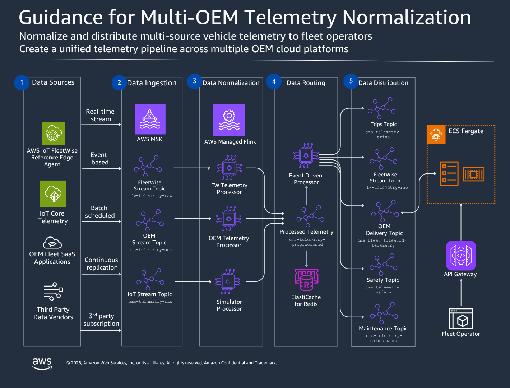

# Telemetry Normalization — ADP Data Product



A use case for the Automotive Data Platform that demonstrates multi-source vehicle telemetry normalization, storage, and distribution for fleet management.

## What This Provides

- **Cloud-to-cloud OEM integration** — authenticate to multiple OEM cloud APIs using OAuth 2.0, ingest telemetry, and normalize to a canonical format
- **Multi-source normalization** — unified signal schema regardless of whether data arrives via direct MQTT, AWS IoT FleetWise (CAN bus), or OEM cloud APIs
- **Queryable data product** — Iceberg tables partitioned by fleet for historical analytics via Athena with row-level tenant isolation
- **Real-time telemetry distribution** — fleet operators receive live FleetWise Edge telemetry via WebSocket, scoped to their enrolled vehicles

## Data Flow

```
Data Sources:
  Direct/Simulator ──→ IoT Core MQTT ──→ Kafka (raw)
  FleetWise Edge   ──→ IoT Core      ──→ Kafka (protobuf)
  OEM Cloud APIs   ──→ Poller/Receiver──→ Kafka (OEM JSON)

Normalization:
  Source-specific Flink preprocessors → canonical JSON (single schema)

Routing & Distribution:
  → Redis (latest vehicle state for REST API)
  → Per-fleet Kafka topics → WebSocket push (FWE telemetry)
  → S3 Iceberg sink (historical analytics)
  → Domain topics (trips, safety, maintenance processors)

Consumption:
  Fleet operators → WebSocket (real-time FWE telemetry)
  Fleet operators → REST API (latest state, any source)
  Fleet operators → Athena (historical analytics, any source)
```

## Prerequisites

This data product consumes from the Connected Mobility Guidance pipeline. The following CMS stacks must be deployed first (in order):

| CMS Stack | What It Provides | Deploy Command |
|-----------|-----------------|----------------|
| `cms-{stage}-storage` | DynamoDB tables (vehicles, fleets, fleet-enrollment, ws-connections, signal-catalog) | `make phase1` |
| `cms-{stage}-msk` | MSK (Kafka) cluster, VPC, Redis (ElastiCache), security groups | `make phase3` |
| `cms-{stage}-telemetry-integration` | IoT Core → MSK routing rules, VPC destination | `make phase3b` |
| `cms-{stage}-iot` | IoT Core policies, device lifecycle handlers | `make phase1` |
| `cms-{stage}-ui` | API Gateway (REST + WebSocket), Cognito user pool with groups, Lambda API, CloudFront UI | `make phase1` |
| `cms-{stage}-flink` | Flink applications (preprocessors + EventDrivenTelemetryProcessor) | `make phase4` + `make configure-flink` |

### Key infrastructure this project depends on:

- **MSK (Kafka)** — per-fleet topics (`cms-fleet-{fleetId}-telemetry`) produced by the Flink EventDrivenTelemetryProcessor
- **VPC + security groups** — the fanout consumer runs in the same VPC as MSK to access Kafka brokers
- **Redis (ElastiCache)** — used by Flink for fleet enrollment cache and vehicle state; REST API reads latest state from here
- **WebSocket API Gateway** — the push endpoint that external consumers connect to (`wss://{id}.execute-api.{region}.amazonaws.com/live`)
- **DynamoDB ws-connections table** — stores active WebSocket connections with `fleetId-index` GSI
- **Cognito user pool** — JWT authentication with `platform-admin`, `fleet-operator`, `fleet-viewer` groups and `custom:fleetIds` attribute
- **Fleet enrollment table** — maps `vehicleId → fleetId`, used by Flink to route telemetry to per-fleet topics
- **Signal catalog table** — defines canonical signal names and units; used by all preprocessors

### Verify prerequisites

```bash
# Check MSK cluster exists and has bootstrap servers
aws kafka list-clusters --query 'ClusterInfoList[?ClusterName==`cms-${DEPLOYMENT_STAGE}-msk`].ClusterArn' --output text --region ${AWS_REGION}

# Check WebSocket API is deployed
aws cloudformation describe-stacks --stack-name cms-${DEPLOYMENT_STAGE}-ui \
  --query "Stacks[0].Outputs[?OutputKey=='WebSocketEndpoint'].OutputValue" --output text --region ${AWS_REGION}

# Check Flink apps are running
aws kinesisanalyticsv2 list-applications --query 'ApplicationSummaries[].ApplicationName' --output table --region ${AWS_REGION}

# Check fleet enrollment table has data
aws dynamodb scan --table-name cms-${DEPLOYMENT_STAGE}-storage-fleet-enrollment --select COUNT --region ${AWS_REGION}
```

## Setup

### Deploy the WebSocket fanout service

```bash
cd guidance-for-telemetry-normalization

# First time: bootstrap CDK
make bootstrap AWS_REGION=<your-region>

# Deploy
make deploy DEPLOYMENT_STAGE=<stage> AWS_REGION=<your-region>

# Or use the deploy script directly
./deploy.sh --stage <stage> --region <your-region>
```

### Create the analytics data product

1. Create the Glue database:
```bash
aws glue create-database --database-input '{"Name": "cms_telemetry"}' --region ${AWS_REGION}
```

2. Run the Iceberg DDL (replace `${DATALAKE_BUCKET}`):
```bash
aws athena start-query-execution \
  --query-string "$(cat datasource/telemetry-lake/iceberg_tables.sql)" \
  --result-configuration OutputLocation=s3://${DATALAKE_BUCKET}/athena-results/ \
  --region ${AWS_REGION}
```

3. Apply Lake Formation policies per `datasource/telemetry-lake/lake_formation_policies.json`

## Athena Queries

| Query | Purpose |
|-------|---------|
| `fleet_utilization.sql` | Daily metrics per fleet (active vehicles, trips, miles, avg speed) |
| `normalized_trips.sql` | Trip history across all sources for a fleet |
| `oem_signal_coverage.sql` | Signal availability by source |
| `vehicle_health_snapshot.sql` | Latest telemetry per vehicle in a fleet |

All queries accept `${FLEET_ID}` as a parameter for fleet scoping.

## Documentation

- [Architecture Guide](docs/ARCHITECTURE.md) — normalization pipeline, OEM integration patterns, distribution design
- [Consumer Guide](docs/CONSUMER_GUIDE.md) — how fleet operators connect to the real-time telemetry feed
